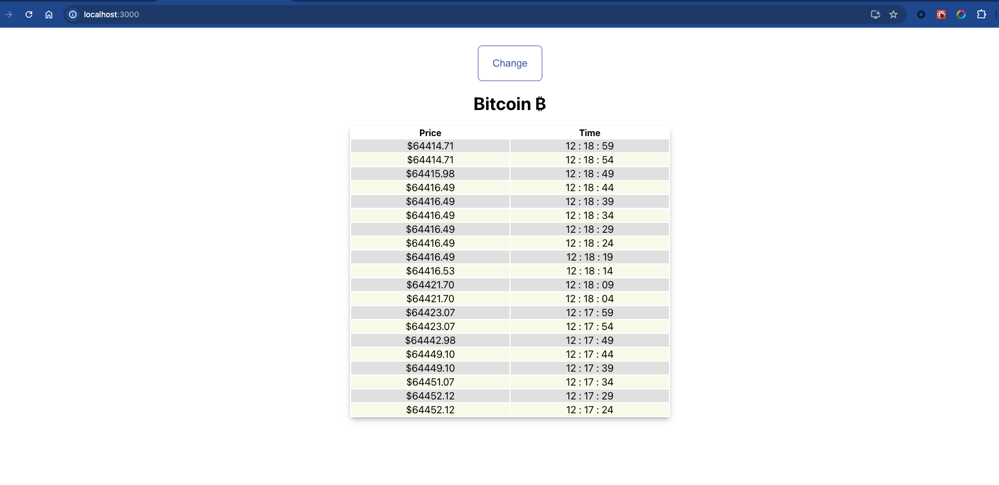
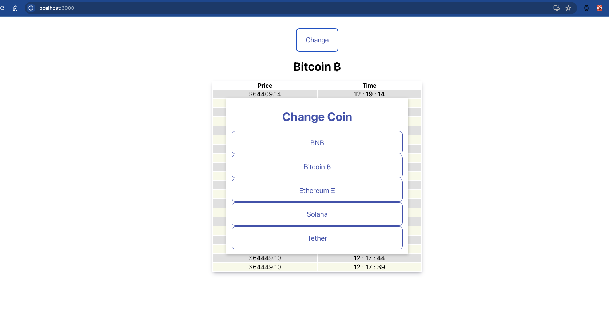

# Real Time Stock Pricing

This fullstack project involves creating a real-time cryptocurrency price tracking application using React, Redux, Express, and Server-Sent Events (SSE). The application allows users to view and track the latest prices of various cryptocurrencies in real time.

## Setup
 before setting up services , first clone the repo
### Backend
  1. cd real_time_stock_pricing > backend
  2. create .env and add following variables

    PORT= {port number for app}
    MONGO_URL= {db url}
    COIN_PRICE_FETCH_URL= {url of third party service from where we want to fetch coin rates}
    API_KEY= { api key to fetch coin rates from third party service}
    CURRENCY= {currency}
    COIN_LIMIT= {how many coins you want to fetch}
  3. npm install
  4. npm start (before starting make sure mongodb is running)

### Frontend
  1. cd real_time_stock_pricing > frontend
  2.  create .env and add following variables
    
    REACT_APP_API_URL= {backend url}

  3. npm install
  4. npm start (before starting make sure backend is running)  

## Demo Images

